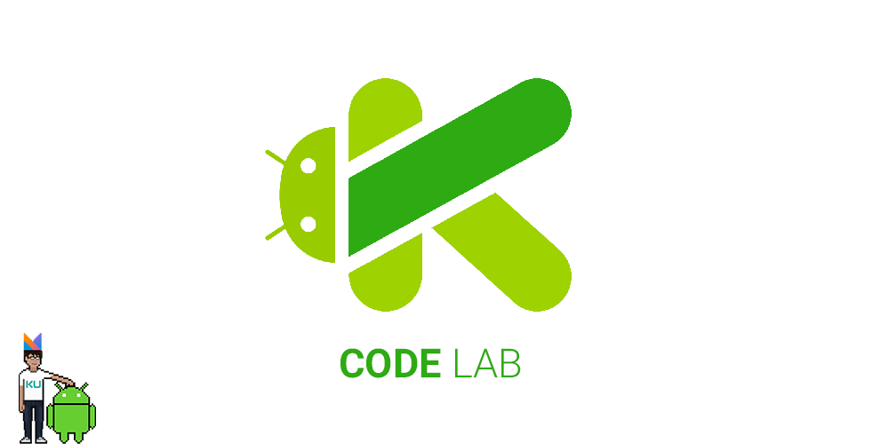
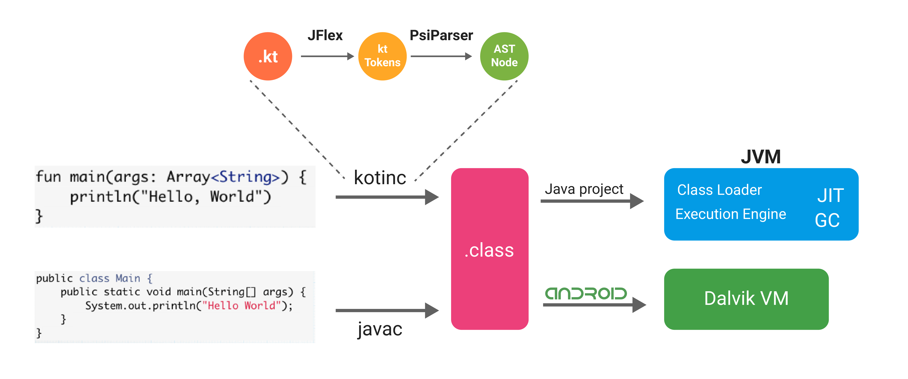
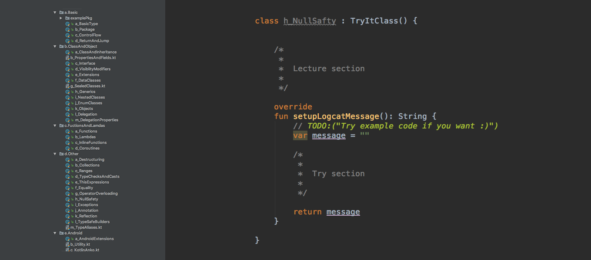
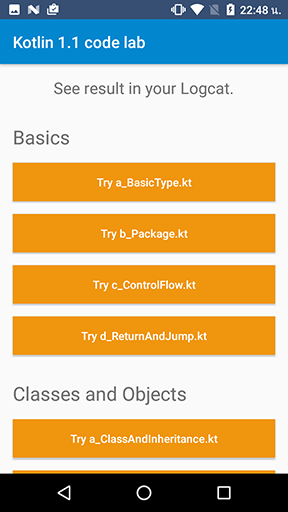
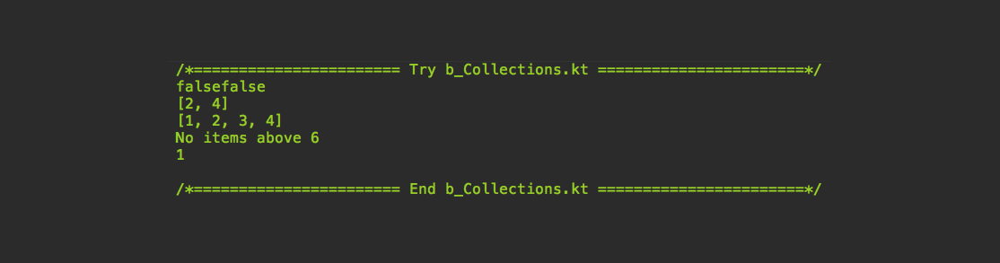

# **「 Kotlin Android code lab 」**



[[TH] kotlin codelab blog](https://blog.nextzy.me/why-we-use-kotlin-and-code-labs-3b0b02a2ad6b)

[EN] kotlin codelab blog [comming soon]


## 「 Usage 」

```git
git clone https://github.com/TheKhaeng/kotlin-android-codelab.git
```

open this project and run :)


## 「 Code lab 」

This code lab contains examples for testing Kotlin language, you can try
different scenarios and check the results. We believe that this way will help
you understand the code more than just reading, and it will reduce the learning curve.
To do it, open
[reference to the Kotlin language](https://www.kotlinlang.org/docs/reference/)
and try it in this code lab.




## 「 Lecture 」
So this codelab we follow the doc reference at [kotlinlang.org/docs/reference/](https://www.kotlinlang.org/docs/reference/)



The class represents the lecture topic, there are two main parts in each class:

1. **Lecture section**: a sample code for each lecture.
2. **Try section**: there's example code in this section already, you can modify and play with it
result message will be displayed in logcat.



The button will replace the class or lecture

when you push the button it will take the message in function
```java
fun setupLogcatMessage(): String {
   ...
}
```
to show in your logcat





# Licence

Copyright 2017 TheKhaeng

Licensed under the Apache License, Version 2.0 (the "License"); you may not use this work except in compliance with the License. You may obtain a copy of the License in the LICENSE file, or at:

http://www.apache.org/licenses/LICENSE-2.0

Unless required by applicable law or agreed to in writing, software distributed under the License is distributed on an "AS IS" BASIS, WITHOUT WARRANTIES OR CONDITIONS OF ANY KIND, either express or implied. See the License for the specific language governing permissions and limitations under the License.


### Developed By Thai android developer.


Follow [facebook.com/thekhaeng.io](https://www.facebook.com/thekhaeng.io) on Facebook page.
or [@nonthawit](https://medium.com/@nonthawit) at my Medium blog. :)

For contact, shoot me an email at nonthawit.thekhaeng@gmail.com
